> Bản đồ kiến trúc tự động tạo giúp AI Agent ghi nhớ các cấu trúc, component và module có sẵn.
> **Số file:** 50 | **Số Functions/Classes:** 930
> *Tự động tạo vào: 4/9/2026, 1:22:22 PM*

---

## 🌳 Sơ đồ Cấu trúc (Visual Architecture)

```mermaid
graph TD
  Root["🚀 Cấp Root / Dự án"]
  N0["📂 .agent"]
  style N0 fill:#636e72,stroke:#ffeaa7,color:#fff
  Root --> N0
  N1["📂 skills"]
  style N1 fill:#636e72,stroke:#ffeaa7,color:#fff
  N0 --> N1
  N2["📂 frontend-design"]
  style N2 fill:#636e72,stroke:#ffeaa7,color:#fff
  N1 --> N2
  N3["📂 scripts"]
  style N3 fill:#636e72,stroke:#ffeaa7,color:#fff
  N2 --> N3
  N4["📄 analyze-accessibility.ts (17 items)"]
  style N4 fill:#2d3436,stroke:#74b9ff,stroke-width:2px,color:#fff
  N3 --> N4
  N5["📄 analyze-styles.ts (16 items)"]
  style N5 fill:#2d3436,stroke:#74b9ff,stroke-width:2px,color:#fff
  N3 --> N5
  N6["📄 extract-tokens.ts (14 items)"]
  style N6 fill:#2d3436,stroke:#74b9ff,stroke-width:2px,color:#fff
  N3 --> N6
  N7["📄 generate-component.ts (11 items)"]
  style N7 fill:#2d3436,stroke:#74b9ff,stroke-width:2px,color:#fff
  N3 --> N7
  N8["📄 generate-palette.ts (25 items)"]
  style N8 fill:#2d3436,stroke:#74b9ff,stroke-width:2px,color:#fff
  N3 --> N8
  N9["📄 generate-tokens.ts (14 items)"]
  style N9 fill:#2d3436,stroke:#74b9ff,stroke-width:2px,color:#fff
  N3 --> N9
  N10["📄 generate-typography.ts (13 items)"]
  style N10 fill:#2d3436,stroke:#74b9ff,stroke-width:2px,color:#fff
  N3 --> N10
  N11["📂 .agents"]
  style N11 fill:#636e72,stroke:#ffeaa7,color:#fff
  Root --> N11
  N12["📂 skills"]
  style N12 fill:#636e72,stroke:#ffeaa7,color:#fff
  N11 --> N12
  N13["📂 frontend-design"]
  style N13 fill:#636e72,stroke:#ffeaa7,color:#fff
  N12 --> N13
  N14["📂 scripts"]
  style N14 fill:#636e72,stroke:#ffeaa7,color:#fff
  N13 --> N14
  N15["📄 analyze-accessibility.ts (17 items)"]
  style N15 fill:#2d3436,stroke:#74b9ff,stroke-width:2px,color:#fff
  N14 --> N15
  N16["📄 analyze-styles.ts (16 items)"]
  style N16 fill:#2d3436,stroke:#74b9ff,stroke-width:2px,color:#fff
  N14 --> N16
  N17["📄 extract-tokens.ts (14 items)"]
  style N17 fill:#2d3436,stroke:#74b9ff,stroke-width:2px,color:#fff
  N14 --> N17
  N18["📄 generate-component.ts (11 items)"]
  style N18 fill:#2d3436,stroke:#74b9ff,stroke-width:2px,color:#fff
  N14 --> N18
  N19["📄 generate-palette.ts (25 items)"]
  style N19 fill:#2d3436,stroke:#74b9ff,stroke-width:2px,color:#fff
  N14 --> N19
  N20["📄 generate-tokens.ts (14 items)"]
  style N20 fill:#2d3436,stroke:#74b9ff,stroke-width:2px,color:#fff
  N14 --> N20
  N21["📄 generate-typography.ts (13 items)"]
  style N21 fill:#2d3436,stroke:#74b9ff,stroke-width:2px,color:#fff
  N14 --> N21
  N22["📂 .claude"]
  style N22 fill:#636e72,stroke:#ffeaa7,color:#fff
  Root --> N22
  N23["📂 skills"]
  style N23 fill:#636e72,stroke:#ffeaa7,color:#fff
  N22 --> N23
  N24["📂 frontend-design"]
  style N24 fill:#636e72,stroke:#ffeaa7,color:#fff
  N23 --> N24
  N25["📂 scripts"]
  style N25 fill:#636e72,stroke:#ffeaa7,color:#fff
  N24 --> N25
  N26["📄 analyze-accessibility.ts (17 items)"]
  style N26 fill:#2d3436,stroke:#74b9ff,stroke-width:2px,color:#fff
  N25 --> N26
  N27["📄 analyze-styles.ts (16 items)"]
  style N27 fill:#2d3436,stroke:#74b9ff,stroke-width:2px,color:#fff
  N25 --> N27
  N28["📄 extract-tokens.ts (14 items)"]
  style N28 fill:#2d3436,stroke:#74b9ff,stroke-width:2px,color:#fff
  N25 --> N28
  N29["📄 generate-component.ts (11 items)"]
  style N29 fill:#2d3436,stroke:#74b9ff,stroke-width:2px,color:#fff
  N25 --> N29
  N30["📄 generate-palette.ts (25 items)"]
  style N30 fill:#2d3436,stroke:#74b9ff,stroke-width:2px,color:#fff
  N25 --> N30
  N31["📄 generate-tokens.ts (14 items)"]
  style N31 fill:#2d3436,stroke:#74b9ff,stroke-width:2px,color:#fff
  N25 --> N31
  N32["📄 generate-typography.ts (13 items)"]
  style N32 fill:#2d3436,stroke:#74b9ff,stroke-width:2px,color:#fff
  N25 --> N32
  N33["📂 .trae"]
  style N33 fill:#636e72,stroke:#ffeaa7,color:#fff
  Root --> N33
  N34["📂 skills"]
  style N34 fill:#636e72,stroke:#ffeaa7,color:#fff
  N33 --> N34
  N35["📂 frontend-design"]
  style N35 fill:#636e72,stroke:#ffeaa7,color:#fff
  N34 --> N35
  N36["📂 scripts"]
  style N36 fill:#636e72,stroke:#ffeaa7,color:#fff
  N35 --> N36
  N37["📄 analyze-accessibility.ts (17 items)"]
  style N37 fill:#2d3436,stroke:#74b9ff,stroke-width:2px,color:#fff
  N36 --> N37
  N38["📄 analyze-styles.ts (16 items)"]
  style N38 fill:#2d3436,stroke:#74b9ff,stroke-width:2px,color:#fff
  N36 --> N38
  N39["📄 extract-tokens.ts (14 items)"]
  style N39 fill:#2d3436,stroke:#74b9ff,stroke-width:2px,color:#fff
  N36 --> N39
  N40["📄 generate-component.ts (11 items)"]
  style N40 fill:#2d3436,stroke:#74b9ff,stroke-width:2px,color:#fff
  N36 --> N40
  N41["📄 generate-palette.ts (25 items)"]
  style N41 fill:#2d3436,stroke:#74b9ff,stroke-width:2px,color:#fff
  N36 --> N41
  N42["📄 generate-tokens.ts (14 items)"]
  style N42 fill:#2d3436,stroke:#74b9ff,stroke-width:2px,color:#fff
  N36 --> N42
  N43["📄 generate-typography.ts (13 items)"]
  style N43 fill:#2d3436,stroke:#74b9ff,stroke-width:2px,color:#fff
  N36 --> N43
  N44["📂 client"]
  style N44 fill:#636e72,stroke:#ffeaa7,color:#fff
  Root --> N44
  N45["📂 js"]
  style N45 fill:#636e72,stroke:#ffeaa7,color:#fff
  N44 --> N45
  N46["📄 main.js (270 items)"]
  style N46 fill:#2d3436,stroke:#74b9ff,stroke-width:2px,color:#fff
  N45 --> N46
  N47["📂 modules"]
  style N47 fill:#636e72,stroke:#ffeaa7,color:#fff
  N45 --> N47
  N48["📄 asset_manager.js (2 items)"]
  style N48 fill:#2d3436,stroke:#74b9ff,stroke-width:2px,color:#fff
  N47 --> N48
  N49["📄 auth.js (16 items)"]
  style N49 fill:#2d3436,stroke:#74b9ff,stroke-width:2px,color:#fff
  N47 --> N49
  N50["📄 board_tools.js (22 items)"]
  style N50 fill:#2d3436,stroke:#74b9ff,stroke-width:2px,color:#fff
  N47 --> N50
  N51["📄 bridge-server.js (12 items)"]
  style N51 fill:#2d3436,stroke:#74b9ff,stroke-width:2px,color:#fff
  N47 --> N51
  N52["📄 card_name_resolver.js (3 items)"]
  style N52 fill:#2d3436,stroke:#74b9ff,stroke-width:2px,color:#fff
  N47 --> N52
  N53["📄 index.js (3 items)"]
  style N53 fill:#2d3436,stroke:#74b9ff,stroke-width:2px,color:#fff
  N47 --> N53
  N54["📄 playback_controller.js (1 items)"]
  style N54 fill:#2d3436,stroke:#74b9ff,stroke-width:2px,color:#fff
  N47 --> N54
  N55["📄 script_loader.js (2 items)"]
  style N55 fill:#2d3436,stroke:#74b9ff,stroke-width:2px,color:#fff
  N47 --> N55
  N56["📄 slot_group_manager.js (17 items)"]
  style N56 fill:#2d3436,stroke:#74b9ff,stroke-width:2px,color:#fff
  N47 --> N56
  N57["📄 snapshot_manager.js (1 items)"]
  style N57 fill:#2d3436,stroke:#74b9ff,stroke-width:2px,color:#fff
  N47 --> N57
  N58["📄 step_property_manager.js (1 items)"]
  style N58 fill:#2d3436,stroke:#74b9ff,stroke-width:2px,color:#fff
  N47 --> N58
  N59["📄 timeline_manager.js (1 items)"]
  style N59 fill:#2d3436,stroke:#74b9ff,stroke-width:2px,color:#fff
  N47 --> N59
  N60["📄 timeline_ui.js (2 items)"]
  style N60 fill:#2d3436,stroke:#74b9ff,stroke-width:2px,color:#fff
  N47 --> N60
  N61["📄 transform_indicator.js (13 items)"]
  style N61 fill:#2d3436,stroke:#74b9ff,stroke-width:2px,color:#fff
  N47 --> N61
  N62["📄 updater.js (7 items)"]
  style N62 fill:#2d3436,stroke:#74b9ff,stroke-width:2px,color:#fff
  N47 --> N62
  N63["📂 utils"]
  style N63 fill:#636e72,stroke:#ffeaa7,color:#fff
  N45 --> N63
  N64["📄 event_emitter.js (1 items)"]
  style N64 fill:#2d3436,stroke:#74b9ff,stroke-width:2px,color:#fff
  N63 --> N64
  N65["📂 tools"]
  style N65 fill:#636e72,stroke:#ffeaa7,color:#fff
  N44 --> N65
  N66["📂 deck-prepper"]
  style N66 fill:#636e72,stroke:#ffeaa7,color:#fff
  N65 --> N66
  N67["📄 prepper.js (15 items)"]
  style N67 fill:#2d3436,stroke:#74b9ff,stroke-width:2px,color:#fff
  N66 --> N67
  N68["📂 faq"]
  style N68 fill:#636e72,stroke:#ffeaa7,color:#fff
  Root --> N68
  N69["📄 script.js (4 items)"]
  style N69 fill:#2d3436,stroke:#74b9ff,stroke-width:2px,color:#fff
  N68 --> N69
  N70["📄 generate_memory.js (6 items)"]
  style N70 fill:#2d3436,stroke:#74b9ff,stroke-width:2px,color:#fff
  Root --> N70
  N71["📂 host"]
  style N71 fill:#636e72,stroke:#ffeaa7,color:#fff
  Root --> N71
  N72["📄 index.jsx (48 items)"]
  style N72 fill:#2d3436,stroke:#74b9ff,stroke-width:2px,color:#fff
  N71 --> N72
  N73["📂 lib"]
  style N73 fill:#636e72,stroke:#ffeaa7,color:#fff
  Root --> N73
  N74["📄 CSInterface.js (43 items)"]
  style N74 fill:#2d3436,stroke:#74b9ff,stroke-width:2px,color:#fff
  N73 --> N74
```

## 🧩 Component & Logic Registry (Danh sách Hàm & Class)

| File (Relative Path) | Entities (Hàm / Class) |
| :--- | :--- |
| **.agent/skills/frontend-design/scripts/analyze-accessibility.ts** | `f() hexToRgb`, `f() getLuminance`, `f() getContrastRatio`, `f() getLineNumber`, `f() analyzeContent`, `f() analyzeColorContrast`, `f() generatePassedChecks`, `f() categoryIssues`, `f() hasErrors`, `f() calculateScore`, `f() analyzeAccessibility`, `f() errors`, `f() warnings`, `f() formatSummary`, `f() printHelp`, `f() main`, `f() hasErrors` |
| **.agent/skills/frontend-design/scripts/analyze-styles.ts** | `f() normalizeColor`, `f() suggestTokenName`, `f() parseCSS`, `f() analyzeColors`, `f() analyzeTypography`, `f() analyzeSpacing`, `f() findInconsistencies`, `f() hexColors`, `f() fontFamilies`, `f() areColorsSimilar`, `f() generateRecommendations`, `f() pixelSpacing`, `f() analyzeStyles`, `f() formatSummary`, `f() printHelp`, `f() main` |
| **.agent/skills/frontend-design/scripts/extract-tokens.ts** | `f() classifyToken`, `f() inferTokenType`, `f() extractCSSVariables`, `f() extractRepeatedValues`, `f() extractTokens`, `f() isTokenized`, `f() formatAsCSS`, `f() formatAsSCSS`, `f() formatAsTailwind`, `f() formatAsStyleDictionary`, `f() formatAsTokensStudio`, `f() formatOutput`, `f() printHelp`, `f() main` |
| **.agent/skills/frontend-design/scripts/generate-component.ts** | `f() getButtonTemplate`, `f() getCardTemplate`, `f() getInputTemplate`, `f() generateReact`, `f() generateVue`, `f() generateSvelte`, `f() generateHTML`, `f() getFileExtension`, `f() generateComponent`, `f() printHelp`, `f() main` |
| **.agent/skills/frontend-design/scripts/generate-palette.ts** | `f() hexToRgb`, `f() rgbToHex`, `f() toHex`, `f() rgbToHsl`, `f() hslToRgb`, `f() hue2rgb`, `f() adjustHsl`, `f() generateShadeScale`, `f() generateThemeColors`, `f() applyStyle`, `f() generateSemanticColors`, `f() generateNeutralScale`, `f() generateSecondaryColor`, `f() generateAccentColor`, `f() generatePalette`, `f() formatAsCSS`, `f() formatColor`, `f() formatAsSCSS`, `f() formatColor`, `f() formatAsTailwind`, `f() formatAsTokens`, `f() formatTokens`, `f() formatOutput`, `f() printHelp`, `f() main` |
| **.agent/skills/frontend-design/scripts/generate-tokens.ts** | `f() flattenTokens`, `f() generateCSS`, `f() generateSCSS`, `f() generateJSON`, `f() generateJS`, `f() generateTS`, `f() generateTailwind`, `f() generateStyleDictionary`, `f() convertToSD`, `f() getFileExtension`, `f() getFileName`, `f() generateTokens`, `f() printHelp`, `f() main` |
| **.agent/skills/frontend-design/scripts/generate-typography.ts** | `f() createFontStack`, `f() generateFontSizes`, `f() generateFontWeights`, `f() generateLetterSpacing`, `f() generateResponsiveSizes`, `f() generateTypography`, `f() formatAsCSS`, `f() formatAsSCSS`, `f() formatAsTailwind`, `f() formatAsTokens`, `f() formatOutput`, `f() printHelp`, `f() main` |
| **.agents/skills/frontend-design/scripts/analyze-accessibility.ts** | `f() hexToRgb`, `f() getLuminance`, `f() getContrastRatio`, `f() getLineNumber`, `f() analyzeContent`, `f() analyzeColorContrast`, `f() generatePassedChecks`, `f() categoryIssues`, `f() hasErrors`, `f() calculateScore`, `f() analyzeAccessibility`, `f() errors`, `f() warnings`, `f() formatSummary`, `f() printHelp`, `f() main`, `f() hasErrors` |
| **.agents/skills/frontend-design/scripts/analyze-styles.ts** | `f() normalizeColor`, `f() suggestTokenName`, `f() parseCSS`, `f() analyzeColors`, `f() analyzeTypography`, `f() analyzeSpacing`, `f() findInconsistencies`, `f() hexColors`, `f() fontFamilies`, `f() areColorsSimilar`, `f() generateRecommendations`, `f() pixelSpacing`, `f() analyzeStyles`, `f() formatSummary`, `f() printHelp`, `f() main` |
| **.agents/skills/frontend-design/scripts/extract-tokens.ts** | `f() classifyToken`, `f() inferTokenType`, `f() extractCSSVariables`, `f() extractRepeatedValues`, `f() extractTokens`, `f() isTokenized`, `f() formatAsCSS`, `f() formatAsSCSS`, `f() formatAsTailwind`, `f() formatAsStyleDictionary`, `f() formatAsTokensStudio`, `f() formatOutput`, `f() printHelp`, `f() main` |
| **.agents/skills/frontend-design/scripts/generate-component.ts** | `f() getButtonTemplate`, `f() getCardTemplate`, `f() getInputTemplate`, `f() generateReact`, `f() generateVue`, `f() generateSvelte`, `f() generateHTML`, `f() getFileExtension`, `f() generateComponent`, `f() printHelp`, `f() main` |
| **.agents/skills/frontend-design/scripts/generate-palette.ts** | `f() hexToRgb`, `f() rgbToHex`, `f() toHex`, `f() rgbToHsl`, `f() hslToRgb`, `f() hue2rgb`, `f() adjustHsl`, `f() generateShadeScale`, `f() generateThemeColors`, `f() applyStyle`, `f() generateSemanticColors`, `f() generateNeutralScale`, `f() generateSecondaryColor`, `f() generateAccentColor`, `f() generatePalette`, `f() formatAsCSS`, `f() formatColor`, `f() formatAsSCSS`, `f() formatColor`, `f() formatAsTailwind`, `f() formatAsTokens`, `f() formatTokens`, `f() formatOutput`, `f() printHelp`, `f() main` |
| **.agents/skills/frontend-design/scripts/generate-tokens.ts** | `f() flattenTokens`, `f() generateCSS`, `f() generateSCSS`, `f() generateJSON`, `f() generateJS`, `f() generateTS`, `f() generateTailwind`, `f() generateStyleDictionary`, `f() convertToSD`, `f() getFileExtension`, `f() getFileName`, `f() generateTokens`, `f() printHelp`, `f() main` |
| **.agents/skills/frontend-design/scripts/generate-typography.ts** | `f() createFontStack`, `f() generateFontSizes`, `f() generateFontWeights`, `f() generateLetterSpacing`, `f() generateResponsiveSizes`, `f() generateTypography`, `f() formatAsCSS`, `f() formatAsSCSS`, `f() formatAsTailwind`, `f() formatAsTokens`, `f() formatOutput`, `f() printHelp`, `f() main` |
| **.claude/skills/frontend-design/scripts/analyze-accessibility.ts** | `f() hexToRgb`, `f() getLuminance`, `f() getContrastRatio`, `f() getLineNumber`, `f() analyzeContent`, `f() analyzeColorContrast`, `f() generatePassedChecks`, `f() categoryIssues`, `f() hasErrors`, `f() calculateScore`, `f() analyzeAccessibility`, `f() errors`, `f() warnings`, `f() formatSummary`, `f() printHelp`, `f() main`, `f() hasErrors` |
| **.claude/skills/frontend-design/scripts/analyze-styles.ts** | `f() normalizeColor`, `f() suggestTokenName`, `f() parseCSS`, `f() analyzeColors`, `f() analyzeTypography`, `f() analyzeSpacing`, `f() findInconsistencies`, `f() hexColors`, `f() fontFamilies`, `f() areColorsSimilar`, `f() generateRecommendations`, `f() pixelSpacing`, `f() analyzeStyles`, `f() formatSummary`, `f() printHelp`, `f() main` |
| **.claude/skills/frontend-design/scripts/extract-tokens.ts** | `f() classifyToken`, `f() inferTokenType`, `f() extractCSSVariables`, `f() extractRepeatedValues`, `f() extractTokens`, `f() isTokenized`, `f() formatAsCSS`, `f() formatAsSCSS`, `f() formatAsTailwind`, `f() formatAsStyleDictionary`, `f() formatAsTokensStudio`, `f() formatOutput`, `f() printHelp`, `f() main` |
| **.claude/skills/frontend-design/scripts/generate-component.ts** | `f() getButtonTemplate`, `f() getCardTemplate`, `f() getInputTemplate`, `f() generateReact`, `f() generateVue`, `f() generateSvelte`, `f() generateHTML`, `f() getFileExtension`, `f() generateComponent`, `f() printHelp`, `f() main` |
| **.claude/skills/frontend-design/scripts/generate-palette.ts** | `f() hexToRgb`, `f() rgbToHex`, `f() toHex`, `f() rgbToHsl`, `f() hslToRgb`, `f() hue2rgb`, `f() adjustHsl`, `f() generateShadeScale`, `f() generateThemeColors`, `f() applyStyle`, `f() generateSemanticColors`, `f() generateNeutralScale`, `f() generateSecondaryColor`, `f() generateAccentColor`, `f() generatePalette`, `f() formatAsCSS`, `f() formatColor`, `f() formatAsSCSS`, `f() formatColor`, `f() formatAsTailwind`, `f() formatAsTokens`, `f() formatTokens`, `f() formatOutput`, `f() printHelp`, `f() main` |
| **.claude/skills/frontend-design/scripts/generate-tokens.ts** | `f() flattenTokens`, `f() generateCSS`, `f() generateSCSS`, `f() generateJSON`, `f() generateJS`, `f() generateTS`, `f() generateTailwind`, `f() generateStyleDictionary`, `f() convertToSD`, `f() getFileExtension`, `f() getFileName`, `f() generateTokens`, `f() printHelp`, `f() main` |
| **.claude/skills/frontend-design/scripts/generate-typography.ts** | `f() createFontStack`, `f() generateFontSizes`, `f() generateFontWeights`, `f() generateLetterSpacing`, `f() generateResponsiveSizes`, `f() generateTypography`, `f() formatAsCSS`, `f() formatAsSCSS`, `f() formatAsTailwind`, `f() formatAsTokens`, `f() formatOutput`, `f() printHelp`, `f() main` |
| **.trae/skills/frontend-design/scripts/analyze-accessibility.ts** | `f() hexToRgb`, `f() getLuminance`, `f() getContrastRatio`, `f() getLineNumber`, `f() analyzeContent`, `f() analyzeColorContrast`, `f() generatePassedChecks`, `f() categoryIssues`, `f() hasErrors`, `f() calculateScore`, `f() analyzeAccessibility`, `f() errors`, `f() warnings`, `f() formatSummary`, `f() printHelp`, `f() main`, `f() hasErrors` |
| **.trae/skills/frontend-design/scripts/analyze-styles.ts** | `f() normalizeColor`, `f() suggestTokenName`, `f() parseCSS`, `f() analyzeColors`, `f() analyzeTypography`, `f() analyzeSpacing`, `f() findInconsistencies`, `f() hexColors`, `f() fontFamilies`, `f() areColorsSimilar`, `f() generateRecommendations`, `f() pixelSpacing`, `f() analyzeStyles`, `f() formatSummary`, `f() printHelp`, `f() main` |
| **.trae/skills/frontend-design/scripts/extract-tokens.ts** | `f() classifyToken`, `f() inferTokenType`, `f() extractCSSVariables`, `f() extractRepeatedValues`, `f() extractTokens`, `f() isTokenized`, `f() formatAsCSS`, `f() formatAsSCSS`, `f() formatAsTailwind`, `f() formatAsStyleDictionary`, `f() formatAsTokensStudio`, `f() formatOutput`, `f() printHelp`, `f() main` |
| **.trae/skills/frontend-design/scripts/generate-component.ts** | `f() getButtonTemplate`, `f() getCardTemplate`, `f() getInputTemplate`, `f() generateReact`, `f() generateVue`, `f() generateSvelte`, `f() generateHTML`, `f() getFileExtension`, `f() generateComponent`, `f() printHelp`, `f() main` |
| **.trae/skills/frontend-design/scripts/generate-palette.ts** | `f() hexToRgb`, `f() rgbToHex`, `f() toHex`, `f() rgbToHsl`, `f() hslToRgb`, `f() hue2rgb`, `f() adjustHsl`, `f() generateShadeScale`, `f() generateThemeColors`, `f() applyStyle`, `f() generateSemanticColors`, `f() generateNeutralScale`, `f() generateSecondaryColor`, `f() generateAccentColor`, `f() generatePalette`, `f() formatAsCSS`, `f() formatColor`, `f() formatAsSCSS`, `f() formatColor`, `f() formatAsTailwind`, `f() formatAsTokens`, `f() formatTokens`, `f() formatOutput`, `f() printHelp`, `f() main` |
| **.trae/skills/frontend-design/scripts/generate-tokens.ts** | `f() flattenTokens`, `f() generateCSS`, `f() generateSCSS`, `f() generateJSON`, `f() generateJS`, `f() generateTS`, `f() generateTailwind`, `f() generateStyleDictionary`, `f() convertToSD`, `f() getFileExtension`, `f() getFileName`, `f() generateTokens`, `f() printHelp`, `f() main` |
| **.trae/skills/frontend-design/scripts/generate-typography.ts** | `f() createFontStack`, `f() generateFontSizes`, `f() generateFontWeights`, `f() generateLetterSpacing`, `f() generateResponsiveSizes`, `f() generateTypography`, `f() formatAsCSS`, `f() formatAsSCSS`, `f() formatAsTailwind`, `f() formatAsTokens`, `f() formatOutput`, `f() printHelp`, `f() main` |
| **client/js/main.js** | `f() debugLog`, `f() msg`, `f() debugWarn`, `f() msg`, `f() fallbackCopyText`, `f() authBoot`, `f() bootApp`, `f() init`, `f() initBriefModal`, `f() closeDialog`, `f() getDOMElements`, `f() bindEvents`, `f() setPhase`, `f() updateLayoutInfoDisplay`, `f() updateFlipControlsVisibility`, `f() handleFlipAllCards`, `f() scanAndPopulateDecks`, `f() deckFolders`, `f() handleDeckSelectChange`, `f() handleLoadDeck`, `f() loadDeckFromPath`, `f() imageFiles`, `f() backFile`, `f() cardFiles`, `f() loadDeckFromFiles`, `f() imageFiles`, `f() backFile`, `f() cardFiles`, `f() createPlaceholderDeck`, `f() createCardData`, `f() renderCardTray`, `f() createTrayCardElement`, `f() createPlaceholderCardImage`, `f() getFilteredTrayCards`, `f() filterTrayCards`, `f() handleSuitFilter`, `f() handleTrayCardDragStart`, `f() handleTrayCardDragEnd`, `f() setupZoneDropTargets`, `f() handleZoneDrop`, `f() droppedCard`, `f() place`, `f() existingCards`, `f() showSwapStackPopup`, `f() swapCards`, `f() moveCardToZone`, `f() oldZoneCards`, `f() newZoneCards`, `f() rerenderZoneCards`, `f() zoneCards`, `f() placeCardInZone`, `f() place`, `f() zoneCards`, `f() placeCardOnTable`, `f() moveCardToPosition`, `f() createZoneCardElement`, `f() place`, `f() totalCards`, `f() createTableCardElement`, `f() handleCardClick`, `f() isInGroup`, `f() selectCard`, `f() deselectCard`, `f() flipCard`, `f() handleZoneFlipChange`, `f() updateCardPosDisplay`, `f() makeCardDraggable`, `f() handleOverlapChange`, `f() reRenderZoneCards`, `f() zoneCards`, `f() handleResetTable`, `f() returnCardToTray`, `f() setupTrayDropTarget`, `f() card`, `f() handleAddStep`, `f() handleFinishStep`, `f() saveInitialState`, `f() takeSnapshot`, `f() computeActions`, `f() getAEPosition`, `f() handlePropertyChange`, `f() uiToAEPosition`, `f() aeToUIPosition`, `f() getUIZonePosition`, `f() place`, `f() getAEZonePosition`, `f() saveInitialStateForExport`, `f() place`, `f() place`, `f() handleExportJSON`, `f() handleExportToAE`, `f() escapeForScript`, `f() handleSelectAssetsFolder`, `f() updateAssetsDisplay`, `f() handleSaveProject`, `f() handleLoadProject`, `f() renderTimeline`, `f() updateUI`, `f() setStatus`, `f() hideInstructions`, `f() showInstructions`, `f() handleReplay`, `f() replayNextStep`, `f() animateCardsSequentially`, `f() animateNext`, `f() stopReplay`, `f() restoreToInitialState`, `f() card`, `f() cardsInInitialState`, `f() handleDeleteStep`, `f() handleEditStep`, `f() renumberSteps`, `f() restoreFromSnapshot`, `f() card`, `f() cardsInSnapshot`, `class if`, `f() showWarningModal`, `f() hideWarningModal`, `f() confirmWarning`, `f() showHelpModal`, `f() hideHelpModal`, `f() initHelpVideoLinks`, `f() showAutoStepPopup`, `f() hideAutoStepPopup`, `f() handleAutoStepYes`, `f() handleAutoStepNo`, `class to`, `f() triggerAutoStepCheck`, `f() showCardContextMenu`, `f() tableCardsOnBoard`, `f() hideCardContextMenu`, `f() setupCtxMenuDrag`, `f() unpinMenu`, `f() updateContextMenuState`, `f() toggleCtxFlip`, `f() handleFlipAni`, `f() toggleCtxSlam`, `f() toggleCtxFlipAll`, `f() enabledCount`, `f() toggleCtxSlamAll`, `f() enabledCount`, `f() toggleCtxSpin`, `f() toggleCtxSpinAll`, `f() enabledCount`, `f() ensureZOrder`, `f() handleLoadPreset`, `f() loadPokerLayout`, `f() loadPusoyLayout`, `f() generatePusoyHand`, `f() loadPusoyMultiLayout`, `f() topSlots`, `f() midSlots`, `f() botSlots`, `f() setupPusoySliderControls`, `f() togglePusoyControls`, `f() updatePusoyLayout`, `f() loadGridLayout`, `f() toggleGridControlsVisibility`, `f() snapCardPlacesToGrid`, `f() handleGridResetDefault`, `f() setupCardSortingSliderControls`, `f() updateGridFromSliders`, `f() setupDealingCardControls`, `f() updateDealTimeEstimate`, `f() renderDealingSlot`, `f() removeDealingSlot`, `f() updateDealingSlotButton`, `f() handleApplyGrid`, `f() handleAddCardPlace`, `f() handleAddCommunityZone`, `f() czCount`, `f() handleClearBoard`, `f() handleSavePreset`, `f() downloadPresetJSON`, `f() saveLayoutToStorage`, `f() loadSavedLayouts`, `f() deleteSavedLayout`, `f() refreshSavedLayoutsDropdown`, `f() getAutosaveFilePath`, `f() autoSaveBoardLayout`, `f() autoRestoreBoardLayout`, `f() renderCardPlaceMarkers`, `class if`, `f() clearCardPlaceMarkers`, `f() renderCardDropZones`, `f() restoreGridCards`, `f() gridCards`, `f() clearCardDropZones`, `f() clearDropZoneSelection`, `f() getSelectedEmptySlots`, `f() showSlotContextMenu`, `f() hideSlotContextMenu`, `f() fillSlotsAuto`, `f() available`, `f() showManualFillOverlay`, `f() hideManualFillOverlay`, `f() executeManualFill`, `f() codes`, `f() trayAvailable`, `f() showManualFillError`, `f() deleteCardPlace`, `f() selectCardPlace`, `f() deselectCardPlace`, `f() updateClonerBtnState`, `f() initCZSettingsPanel`, `f() hasCard`, `f() place`, `f() place`, `f() startDragMarker`, `f() undoSnapshot`, `f() onMouseMove`, `f() onMouseUp`, `f() startRotateMarker`, `f() undoSnapshot`, `f() onMouseMove`, `f() onMouseUp`, `f() startResizeCommunityZone`, `f() undoSnapshot`, `f() onMouseMove`, `f() onMouseUp`, `f() updateCardPlacesList`, `f() updateGroupPanelVisibility`, `f() renderGroupPanel`, `f() updateCreateGroupBtnState`, `f() highlightGroupMarkers`, `f() updateGroupOrderSectionVisibility`, `f() renderGroupOrderStrip`, `f() initTimelineModulesIntegration`, `f() hookTimelineFunctions`, `f() getStepColor`, `f() handleTimelineStepSelect`, `f() handleTimelineStepEdit`, `f() startEditingStep`, `f() handleTimelineStepMove`, `f() refreshTimelineUI`, `f() syncTimelineModulesWithSteps`, `f() updateTimelinePlayhead`, `f() handleGroupingModeChange`, `class for`, `f() handleAutoRecordChange`, `f() handleAutoRecordDelayChange`, `f() toggleCardGroupSelection`, `f() index`, `f() clearGroupedCards`, `f() updateGroupCount`, `f() startAutoRecordCountdown`, `f() cancelAutoRecordCountdown`, `f() autoSaveGroupedStep`, `f() updateGroupingSectionVisibility`, `f() handleGroupedCardsDrop`, `f() oldZoneCards`, `f() enableAIButton`, `f() toggleAIPanel`, `f() handleRefImageAttach`, `f() handleRefVideoAttach`, `f() extractVideoFrames`, `f() captureFrame`, `f() renderAttachPreview`, `f() getAPIBaseUrl`, `f() handleAIGenerate`, `f() applyAILayout`, `f() findTrayCardByName`, `f() findTableCardByName`, `f() silentPlaceCard`, `f() applyAIScenario`, `f() applyScenarioAction`, `f() showAIStatus`, `f() hideAIStatus`, `f() showAIError`, `f() hideAIError` |
| **client/js/modules/asset_manager.js** | `f() checkAssetUpdates`, `f() getLocalAssetVersion` |
| **client/js/modules/auth.js** | `f() loadAuthConfig`, `f() getToken`, `f() getUser`, `f() setAuth`, `f() clearAuth`, `f() decodeJWT`, `f() isTokenValid`, `f() isAuthenticated`, `f() authFetch`, `class AuthError`, `f() login`, `f() logout`, `f() showLoginScreen`, `f() hideLoginScreen`, `f() initLoginUI`, `f() updateUserDisplay` |
| **client/js/modules/board_tools.js** | `f() arrangeRow`, `f() arrangeColumn`, `f() stackSlots`, `f() handleAddPusoyPack`, `f() topRowSlots`, `f() midRowSlots`, `f() bottomRowSlots`, `f() startCloner`, `f() editCloner`, `f() generateClonerPositions`, `f() updateClonerPreview`, `f() applyCloner`, `f() oldGroup`, `f() cancelCloner`, `f() deleteClonerGroup`, `f() group`, `f() showClonerPanel`, `f() hideClonerPanel`, `f() getActivePlaces`, `f() pushBoardUndoSnapshot`, `f() initBoardTools`, `f() applyBgImage` |
| **client/js/modules/bridge-server.js** | `f() hasNodeJS`, `f() startBridgeServer`, `f() stopBridgeServer`, `f() handleStatus`, `f() handleGetPresets`, `f() handleLoadPreset`, `f() handleLoadSetup`, `f() handleLoadScenario`, `f() handleExportAE`, `f() parseBody`, `f() sendJSON`, `f() updateBridgeIndicator` |
| **client/js/modules/card_name_resolver.js** | `f() resolveCardName`, `f() match`, `f() parseCardInput` |
| **client/js/modules/index.js** | `f() initTimelineModules`, `f() hookAfter`, `f() unhook` |
| **client/js/modules/playback_controller.js** | `class PlaybackController` |
| **client/js/modules/script_loader.js** | `f() loadCoreScript`, `f() getLoadedScriptVersion` |
| **client/js/modules/slot_group_manager.js** | `f() getGroupForPlace`, `f() findPlaceById`, `f() computeFinalZOrder`, `f() computeFinalZOrderAtStep`, `f() computeZOrderForCard`, `f() getGroupColor`, `f() generateGroupId`, `f() createSlotGroup`, `f() deleteSlotGroup`, `f() renameSlotGroup`, `f() reorderSlotGroups`, `f() clearAllGroups`, `f() removeSlotFromAllGroups`, `f() cleanupEmptyGroups`, `f() renormalizeGroupOrder`, `f() pushGroupUndoSnapshot`, `f() undoGroupAction` |
| **client/js/modules/snapshot_manager.js** | `class SnapshotManager` |
| **client/js/modules/step_property_manager.js** | `class StepPropertyManager` |
| **client/js/modules/timeline_manager.js** | `class TimelineManager` |
| **client/js/modules/timeline_ui.js** | `class TimelineUI`, `class from` |
| **client/js/modules/transform_indicator.js** | `f() ensureSVGOverlay`, `f() showTransformIndicator`, `f() hideTransformIndicator`, `f() analyzeLayers`, `f() renderSVGIndicator`, `f() mapToDOM`, `f() drawSideLine`, `f() createHandle`, `f() startTransformDrag`, `f() onTransformDragMove`, `f() applyMathToCards`, `f() endTransformDrag`, `f() syncTransformIndicator` |
| **client/js/modules/updater.js** | `f() checkForUpdates`, `f() compareVersions`, `f() applyUpdate`, `f() mkdirRecursive`, `f() updateStatusUI`, `f() initUpdaterUI`, `f() autoCheckUpdate` |
| **client/js/utils/event_emitter.js** | `class EventEmitter` |
| **client/tools/deck-prepper/prepper.js** | `f() init`, `f() renderBoard`, `f() handleBatchUpload`, `f() imageFiles`, `f() setupDragDrop`, `f() handleSlotDrop`, `f() handleMultiDrop`, `f() imageFiles`, `f() backFile`, `f() fillSlot`, `f() handleExport`, `f() downloadBlob`, `f() resizeImage`, `f() blobToBuffer`, `f() showStatus` |
| **faq/script.js** | `f() isMobile`, `f() openSidebar`, `f() closeSidebar`, `f() toggleSidebar` |
| **generate_memory.js** | `f() getFileType`, `f() walkDir`, `f() parseFile`, `f() generateMermaidTree`, `f() run`, `f() eStrs` |
| **host/index.jsx** | `f() generateSequence`, `f() setupInitialScene`, `f() findStrokeWidthInShape`, `f() findStrokeColorInShape`, `f() createCardPrecomp`, `f() importAndAddLayer`, `f() setAnchorPointToCenter`, `f() applyInitialTransform`, `f() createControlLayer`, `f() applyPusoyPositionExpression`, `f() createZoneNulls`, `f() applyScaleExpression`, `f() addPerCardControls`, `f() applyFlipExpression`, `f() applySelectionExpression`, `f() applyZoneOffsetExpression`, `f() processDealingAnimation`, `f() processScenarioAnimation`, `f() shiftZoneCards`, `f() calculateTargetZ`, `f() processSwapInitiator`, `f() processSwapDisplaced`, `f() processSelectionAction`, `f() processTransformAction`, `f() processFlipEffect`, `f() setHoldInterpolation`, `f() processSlamEffect`, `f() processSpinEffect`, `f() createVisualMouseLayer`, `f() setEaseAtKey`, `f() areKeyValuesEqual`, `f() applyBezierEasing`, `f() applyBounceEasing`, `f() calculateTotalDuration`, `f() getOrCreateFolder`, `f() generateSessionId`, `f() setupProjectFolders`, `f() normalizeAssetPath`, `f() resolveAssetPath`, `f() getDimensionCount`, `f() createPlaceholderLayer`, `f() createSuccessResponse`, `f() createErrorResponse`, `f() importPokerScenario`, `f() importPokerScenarioWithAssets`, `f() testConnection`, `f() importPokerAnimation`, `f() importLegacyCardLayer` |
| **lib/CSInterface.js** | `f() CSXSWindowType`, `class Version`, `f() Version`, `class VersionBound`, `f() VersionBound`, `class VersionRange`, `f() VersionRange`, `class Runtime`, `f() Runtime`, `class Extension`, `f() Extension`, `class CSEvent`, `class for`, `f() CSEvent`, `class SystemPath`, `f() SystemPath`, `class ColorType`, `f() ColorType`, `class RGBColor`, `f() RGBColor`, `class Direction`, `f() Direction`, `class GradientStop`, `f() GradientStop`, `class GradientColor`, `f() GradientColor`, `class UIColor`, `f() UIColor`, `class AppSkinInfo`, `f() AppSkinInfo`, `class HostEnvironment`, `f() HostEnvironment`, `class HostCapabilities`, `f() HostCapabilities`, `class ApiVersion`, `f() ApiVersion`, `class MenuItemStatus`, `f() MenuItemStatus`, `class ContextMenuItemStatus`, `f() ContextMenuItemStatus`, `class CSInterface`, `f() CSInterface`, `f() OnAppThemeColorChanged` |

---

## 📝 Project Conventions (Lưu ý cho AI)
- Chỉ sử dụng những hàm có sẵn trong registry này nếu chúng đã được thực thi chức năng bạn cần làm.
- Khi tạo chức năng mới liên quan, hãy khai báo vào file có thư mục đúng nhóm với nó.
